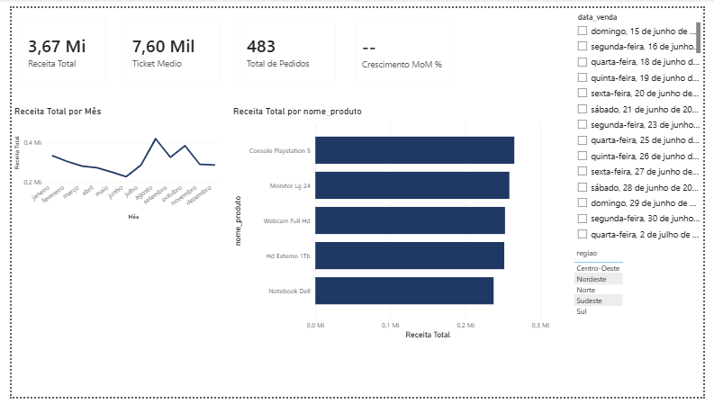
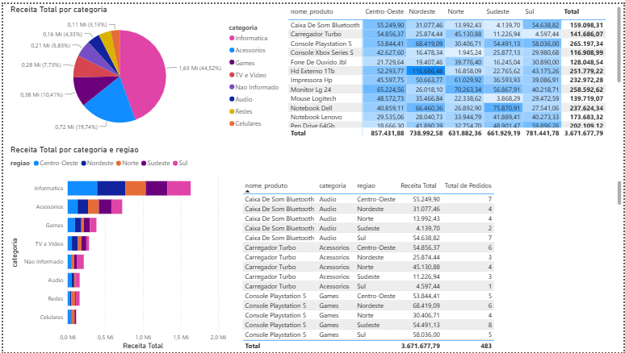
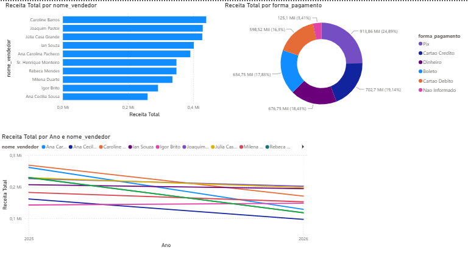

# 📊 Painel de Vendas — Loja de Eletrônicos

> Pipeline ETL completo com Python, PostgreSQL e Power BI, simulando um ambiente real de análise de dados em uma loja de eletrônicos.


---

## 🖥️ Demonstração

### Página 1 — Visão Geral


### Página 2 — Análise por Produto


### Página 3 — Análise por Vendedor


---

## 🏗️ Arquitetura

```
Excel (dados brutos gerados com Faker)
        ↓
Python — limpeza, validação e geração de dados
        ↓
PostgreSQL — modelo estrela via Docker (fato + 4 dimensões)
        ↓
Power BI — dashboard interativo com 3 páginas
```

---

## 📋 Sobre o projeto

O projeto simula o fluxo de dados de uma loja de eletrônicos do zero: desde a geração de dados brutos com erros propositais, passando por limpeza e validação em Python, carga em um banco relacional com modelo estrela, até a visualização em um dashboard Power BI com 3 páginas analíticas.

**Destaques técnicos:**
- 500 registros gerados com Faker, com inconsistências intencionais (datas inválidas, preços negativos, nulos, categorias erradas)
- Pipeline ETL orquestrado por `pipeline.py`: geração → limpeza → carga
- Modelo estrela com `fato_vendas` + 4 dimensões, incluindo VIEW consolidada
- Medidas DAX: Receita Total, Total de Pedidos, Ticket Médio, Receita Mês Anterior, Crescimento MoM%
- Testes automatizados com pytest
- Logging com loguru e variáveis de ambiente com dotenv

---

## 📊 Dashboard Power BI

| Página | Conteúdo |
|--------|----------|
| **Página 1 — Visão Geral** | KPIs, receita por mês, Top 5 produtos, slicers de ano e região |
| **Página 2 — Análise por Produto** | Mapa de calor produto × região, gráfico de pizza por categoria |
| **Página 3 — Análise por Vendedor** | Ranking de vendedores, rosca por forma de pagamento, evolução por vendedor |

---

## 🚀 Como rodar o projeto

### Pré-requisitos

- Python 3.11+
- Docker Desktop
- Power BI Desktop

### Passo a passo

```bash
# 1. Clone o repositório
git clone https://github.com/annakkarolyne/painel-de-vendas.git
cd painel-de-vendas

# 2. Crie e ative o ambiente virtual
python -m venv venv
venv\Scripts\activate

# 3. Instale as dependências
pip install -r requirements.txt

# 4. Suba o banco de dados
docker-compose up -d

# 5. Execute o pipeline completo
python src/pipeline.py
```

Depois de rodar o pipeline, abra o arquivo `.pbix` no Power BI Desktop e conecte ao PostgreSQL local (`localhost:5432`).

---

## 📁 Estrutura do projeto

```
painel-de-vendas/
├── assets/
│   ├── dashboard-pagina1.png
│   ├── dashboard-pagina2.png
│   └── dashboard-pagina3.png
├── data/
│   ├── raw/                # Dados brutos gerados com Faker
│   └── processados/        # Dados limpos e validados
├── src/
│   ├── gerar_dados.py      # Geração de dados com Faker (500 linhas)
│   ├── limpeza.py          # Limpeza e validação dos dados
│   ├── carga_db.py         # Carga no PostgreSQL via SQLAlchemy
│   └── pipeline.py         # Orquestrador do pipeline completo
├── tests/
│   └── test_limpeza.py     # Testes automatizados com pytest
├── docker-compose.yml      # PostgreSQL 16 via Docker
├── esquema.sql             # Modelo estrela + VIEW consolidada
├── requirements.txt
├── DECISOES.md             # Justificativas técnicas das escolhas
└── README.md
```

---

## 🛠️ Tecnologias utilizadas

| Tecnologia | Uso |
|------------|-----|
| Python 3.11 | Geração, limpeza e orquestração do pipeline |
| Faker | Geração de dados fictícios realistas |
| pandas | Limpeza, validação e transformação dos dados |
| SQLAlchemy | ORM para carga no banco de dados |
| PostgreSQL 16 | Banco de dados relacional com modelo estrela |
| Docker Compose | Isolamento e portabilidade do banco |
| Power BI Desktop | Dashboard interativo com medidas DAX |
| pytest | Testes automatizados de limpeza |
| loguru | Logging estruturado do pipeline |
| python-dotenv | Gerenciamento de variáveis de ambiente |

---

## 📈 Aprendizados

- Modelagem dimensional: diferença entre tabela fato e dimensões
- Pipeline ETL completo: geração → limpeza → carga → visualização
- Como usar Docker para isolar e versionar um banco de dados
- Criação de medidas DAX (incluindo cálculo MoM com PREVIOUSMONTH)
- Formatação condicional no Power BI para mapas de calor
- Boas práticas: testes automatizados, logging, variáveis de ambiente

---

## 👩‍💻 Autora

**Ana Caroline Cândida Bugatto**  
Estudante de Análise e Desenvolvimento de Sistemas — Fatec Americana  
[GitHub](https://github.com/annakkarolyne) • [LinkedIn](https://linkedin.com/in/seu-linkedin)